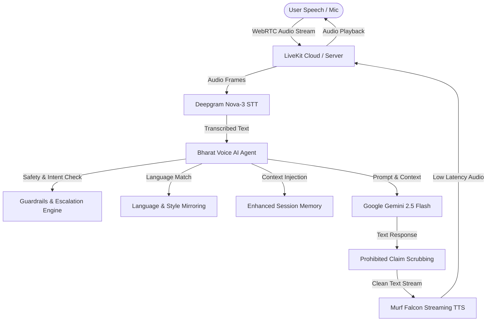

# Bharat Voice AI — Multilingual Voice Assistant for India 🇮🇳

**Bharat Voice AI** is a production-ready, multilingual conversational AI voice assistant built for Indian users as part of the official **"10 Days of AI Voice Agents | Voice for Bharat Edition"** challenge (Day 2 Production Build).

Powered by **Murf Falcon TTS**, **LiveKit Agents SDK**, **Deepgram Nova-3 STT**, and **Google Gemini 2.5 Flash**.

---

## 🚀 Key Features

- **Warm Persona & Speech Optimization**: Natural human voice delivery with female persona and strict Hindi/Gujarati gender agreement (`मैं कर सकती हूँ`, `मेरी`, `गई`).
- **Multilingual & Style Mirroring**: Seamless automatic detection and instant code-mix style mirroring for:
  - English (Indian English)
  - Hindi (हिन्दी)
  - Gujarati (ગુજરાતી)
  - Hinglish (Hindi-English mix)
  - Gujlish (Gujarati-English mix)
- **Safety Guardrails & Escalation**: Robust input/output guardrail engine refusing illegal activities, weapons, hacking, medical/legal/financial advice, OTP phishing, and prohibited claims ("never claim" policy).
- **Silence Handling**: Intelligent voice turn management asking *"Are you still there?"* after inactivity before gracefully concluding.
- **Enhanced Conversation Memory**: Tracks user name, preferred language, current topic, and last spoken responses across turns.
- **Red Team Evaluated**: Fully tested against 20+ adversarial attack prompts documented in [`RED_TEAM.md`](./RED_TEAM.md).

---

## 🏗️ Architecture & Voice Pipeline



---

## 📂 Project Structure

```
murf-livekit-starter/
├── RED_TEAM.md               # 20+ Adversarial Red Team Attack Scenarios & Refusals
├── README.md                 # Project Overview & Architecture
├── backend/
│   ├── src/
│   │   ├── agent.py          # Slim Orchestrator & LiveKit Session Entrypoint
│   │   ├── agent/
│   │   │   ├── config.py     # Environment Validation & Configuration
│   │   │   ├── prompts.py    # Structured Day 2 System Prompts (8 Sections)
│   │   │   ├── guardrails.py # Safety Guardrail Engine & Refusal Rules
│   │   │   ├── language.py   # Script Detection & Language Mirroring (HI, GU, EN, Hinglish, Gujlish)
│   │   │   ├── memory.py     # Persistent Session Memory & State Manager
│   │   │   ├── voice_agent.py# Core BharatVoiceAgent Class & Tools
│   │   │   ├── logger.py     # Structured Observability & Latency Collector
│   │   │   ├── router.py     # Language Router Adapter
│   │   │   ├── analytics.py  # Performance Metrics Aggregator
│   │   │   └── utils.py      # Timing Decorators & Retry Helpers
│   │   └── services/
│   │       ├── gemini.py     # Google Gemini LLM Integration
│   │       ├── stt.py        # Deepgram Nova-3 STT Service Factory
│   │       ├── tts.py        # Murf Falcon TTS Service Factory
│   │       └── llm.py        # LLM Factory Abstraction
│   └── tests/
│       ├── test_agent.py     # Core & LLM-Judged Evaluation Tests
│       └── test_extended_agent.py # Extended Unit & Guardrail Tests
└── frontend/                 # Next.js Voice UI (LiveKit Agents Components)
```

---

## 🛡️ Guardrails & Security Policy

Bharat Voice AI enforces zero-tolerance refusals and prohibited claim filtering:

- **Refused Categories**: Illegal acts, weapons, explosives, hacking, malware, violence, hate speech, self-harm, medical diagnosis, legal advice, financial guarantees/loan approval, government decisions, OTPs, credit cards.
- **Prohibited Claims**: Never claims to be human, claim authority verification, claim external phone calls were made, or claim live market prices.
- **Escalation Script**:
  > *"I'm sorry, I can't safely help with that. Please contact the appropriate professional or official service. Is there something else I can help you with today?"*

See full evaluation suite in [`RED_TEAM.md`](./RED_TEAM.md).

---

## 🧪 Testing

Run unit and LLM-as-judge evaluation tests via `uv`:

```bash
cd backend
uv run pytest
```

Run linter and code style formatting checks:

```bash
cd backend
uv run ruff check .
uv run ruff format .
```

---

## ⚡ Quick Start

### 1. Backend Setup

```bash
cd backend
uv sync
uv run python src/agent.py dev
```

### 2. Frontend Setup

```bash
cd frontend
pnpm install
pnpm dev
```

---

## 🛣️ Roadmap

- [x] **Day 1**: LiveKit + Murf Falcon + Deepgram + Gemini Voice Pipeline Foundation
- [x] **Day 2**: Multilingual Support (HI, GU, EN, Hinglish, Gujlish), Day 2 Prompt Restructuring, Guardrails Engine, Silence Handling, Memory Store, Red Team Suite
- [ ] **Day 3**: Advanced Multi-Turn Conversational Tool Calling & Dynamic Knowledge Retrieval
