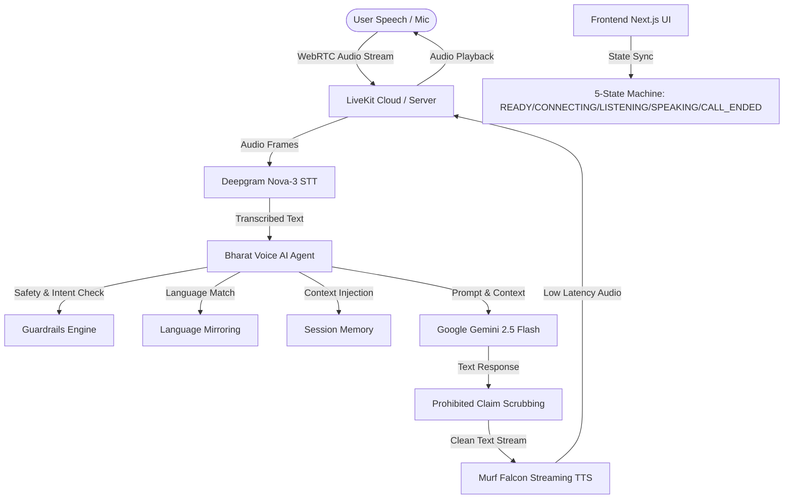

# Bharat Voice AI — Multilingual Voice Assistant for India 🇮🇳

**Bharat Voice AI** is a production-ready, multilingual conversational AI voice assistant built for Indian users as part of the official **"10 Days of AI Voice Agents | Voice for Bharat Edition"** challenge.

Powered by **Murf Falcon TTS**, **LiveKit Agents SDK**, **Deepgram Nova-3 STT**, and **Google Gemini 2.5 Flash**.

---

## 🎨 Day 3: Personalized Frontend

Day 3 introduces a modern, accessible, voice-first frontend tailored for users across India.

### Key UI Features
- **Voice-First Design**: Large, central interactive voice control area built with accessible ARIA labels and smooth micro-animations.
- **Strict 5-State Machine**:
  1. `READY`: Initial state with tagline *"Your voice. Your language. Your AI."*, language highlights (`"Hello • नमस्ते • નમસ્તે"`), and an explicit **"Start Conversation"** mic button.
  2. `CONNECTING`: Displays *"Connecting..."*, *"Please wait while we connect you to Bharat Voice AI"*, and animated pulsing loading indicators.
  3. `LISTENING`: Displays *"Listening to you"* with live microphone waveform volume dynamics.
  4. `SPEAKING`: Displays *"Bharat Voice AI is speaking"* with agent voice output audio visualizer.
  5. `CALL_ENDED`: Displays *"Conversation ended"*, *"Thanks for talking with Bharat Voice AI."*, and a **"Start Again"** button that reconnects without page refresh.
- **Robust Error Recovery**:
  - `PERMISSION_ERROR`: Friendly, step-by-step instructions when browser microphone permission is blocked. Includes a **"Try Again"** button.
  - `CONNECTION_ERROR`: Helpful troubleshooting guidance when LiveKit or network connections fail. Includes a **"Try Again"** button.
- **Live Conversation Transcript**: Compact, collapsible drawer showing You vs Bharat Voice AI transcript history.
- **Accessibility & Responsiveness**: Mobile (`390x844`), Tablet (`768x1024`), and Desktop (`1440x900`) optimized with high contrast, dark/light theme switching, and keyboard navigation.

### Screenshots Placeholder
Place demo screenshots in [`docs/screenshots/`](./docs/screenshots/):
- `docs/screenshots/ready_state.png`
- `docs/screenshots/connecting_state.png`
- `docs/screenshots/listening_state.png`
- `docs/screenshots/speaking_state.png`
- `docs/screenshots/call_ended_state.png`
- `docs/screenshots/permission_error.png`

---

## 🚀 Key Features

- **Warm Persona & Speech Optimization**: Natural human voice delivery with female persona and strict Hindi/Gujarati gender agreement (`मैं कर सकती हूँ`, `मेरी`, `गई`).
- **Multilingual & Style Mirroring**: Automatic script detection and instant code-mix style mirroring for:
  - English (Indian English)
  - Hindi (हिन्दी)
  - Gujarati (ગુજરાતી)
  - Hinglish (Hindi-English mix)
  - Gujlish (Gujarati-English mix)
- **Safety Guardrails & Escalation**: Refuses illegal activities, weapons, hacking, medical/legal/financial advice, OTP phishing, and prohibited claims ("never claim" policy).
- **Silence Handling**: Asks *"Are you still there?"* after turn inactivity before gracefully concluding.
- **Enhanced Session Memory**: Tracks user name, preferred language, current topic, and last spoken responses across turns.

---

## 🏗️ Architecture & Voice Pipeline



---

## 📂 Project Structure

```
murf-livekit-starter/
├── DAY3_IMPLEMENTATION.md    # Day 3 Implementation Analysis Document
├── docs/
│   ├── DAY3.md              # Day 3 Architecture & User Documentation
│   └── screenshots/          # Screenshot Placeholders for Frontend States
├── RED_TEAM.md               # 20+ Adversarial Red Team Attack Scenarios & Refusals
├── README.md                 # Project Overview & Setup Instructions
├── backend/
│   ├── src/
│   │   ├── agent.py          # Slim Orchestrator & LiveKit Session Entrypoint
│   │   ├── agent/            # Config, Prompts, Guardrails, Memory, Logger
│   │   └── services/         # Gemini, Deepgram STT, Murf Falcon TTS
│   └── tests/                # Pytest LLM-Judged Evaluation Suite
└── frontend/                 # Next.js Voice UI
    ├── app-config.ts         # Branding, Title, and App Configuration
    └── components/           # VoiceAgent, Header, Footer, AgentStatus, VoiceButton, AudioVisualizer, Transcript
```

---

## 🧪 Testing

Run backend pytest suite (all 13 tests including LLM-judged evaluators):

```bash
cd backend
uv run pytest
```

Run backend linting:

```bash
cd backend
uv run ruff check .
```

---

## ⚡ Quick Start

### 1. Backend Setup

```bash
cd backend
uv sync
uv run python src/agent.py dev
```

### 2. Frontend Setup

```bash
cd frontend
pnpm install
pnpm dev
```

Open `http://localhost:3000` in your browser.

---

## 🛣️ Roadmap

- [x] **Day 1**: LiveKit + Murf Falcon + Deepgram + Gemini Voice Pipeline Foundation
- [x] **Day 2**: Multilingual Support (HI, GU, EN, Hinglish, Gujlish), Guardrails Engine, Silence Handling, Session Memory, Red Team Suite
- [x] **Day 3**: Personalized Multilingual Voice Frontend, 5-State Machine, Dual Audio Visualizers, Microphone Permission & Connection Error Handling, Compact Transcript
